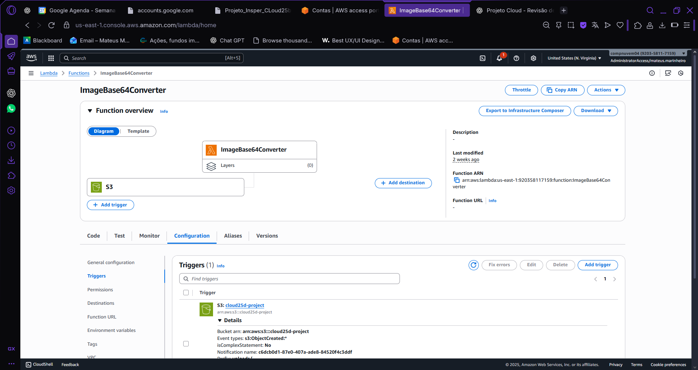
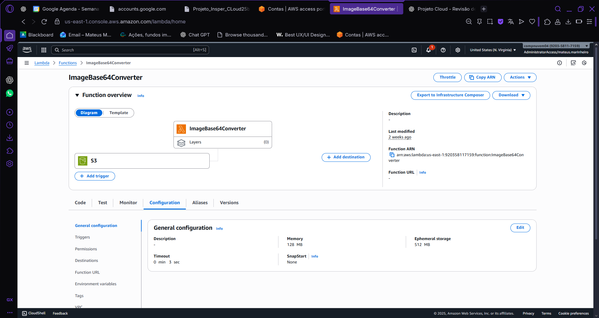
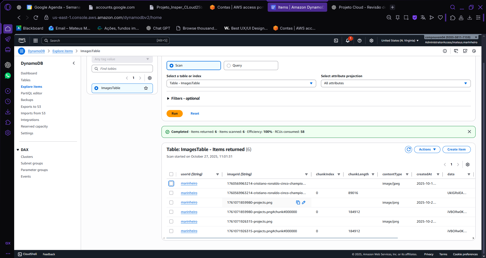
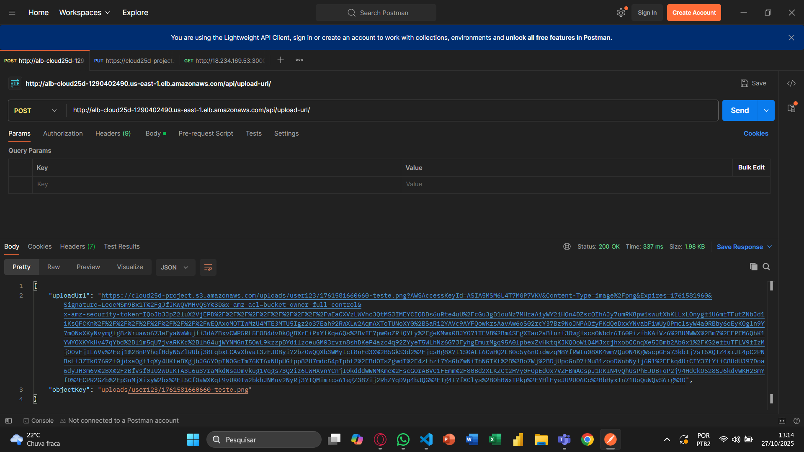
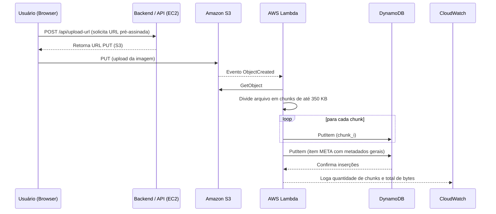

## Anexo A 
---
### Estágio 2 - Upload e Conversão (Lambda + DynamoDB) (Obj. 2 e 3)
--- 
#### Regular (2)

O estágio 2 tem como meta garantir que todo o pipeline de **upload e processamento em nuvem** funcione corretamente:

1. O **front-end ou navegador** solicita ao backend uma **URL pré-assinada** gerada pelo Amazon S3.
2. O arquivo é **enviado diretamente ao bucket S3** usando essa URL.
3. O evento `ObjectCreated` no bucket aciona a **função AWS Lambda**.
4. A Lambda **lê o objeto do S3**, converte o conteúdo em **Base64**, e **grava** no **DynamoDB**.

Esse fluxo comprova a integração dos três serviços principais: **S3**, **Lambda** e **DynamoDB**.

---

##### Componentes e Configurações

##### Amazon S3
- Bucket: `cloud25b-project`
- Evento configurado: `ObjectCreated` → aciona a função Lambda `ImageBAse64Converter`
- Permissões:
  - Política permite `s3:PutObject`, `s3:GetObject` e `s3:ListBucket`
  - Bloqueio de acesso público mantido ativo

**Evidência — Evento configurado no S3**


*Figura 1 — Configuração de evento `ObjectCreated` acionando a função Lambda.*

---

##### AWS Lambda — ImageBAse64Converter
A função Lambda processa os uploads automaticamente:

??? success "Python"
    ```python
    import boto3
    import base64
    from datetime import datetime
    import urllib.parse
    import math
    import os

    s3 = boto3.client('s3')
    dynamodb = boto3.resource('dynamodb')
    TABLE_NAME = os.environ.get('IMAGES_TABLE', 'ImagesTable')

    # Tamanho máximo por chunk (em caracteres Base64). 
    # Recomendo 300000-360000. Não ultrapasse ~400000.
    CHUNK_SIZE = int(os.environ.get('CHUNK_SIZE', '350000'))

    table = dynamodb.Table(TABLE_NAME)

    def lambda_handler(event, context):
        print("DEBUG - evento recebido:", event)
        for record in event.get('Records', []):
            try:
                bucket = record['s3']['bucket']['name']
                key = urllib.parse.unquote_plus(record['s3']['object']['key'])
                print(f"DEBUG - Bucket: {bucket}, Key: {key}")

                if not key.startswith("uploads/"):
                    print(f"DEBUG - Ignorado, key fora do prefixo: {key}")
                    continue

                parts = key.split('/')
                if len(parts) < 3:
                    print(f"DEBUG - Caminho inesperado: {key}")
                    continue

                userId = parts[1]
                imageId = parts[-1]

                # ler objeto do S3
                resp = s3.get_object(Bucket=bucket, Key=key)
                content = resp['Body'].read()
                content_type = resp.get('ContentType', 'application/octet-stream')
                size_bytes = resp.get('ContentLength', len(content))

                # converter para base64 (string ASCII)
                base64_str = base64.b64encode(content).decode('utf-8')
                total_len = len(base64_str)
                total_chunks = math.ceil(total_len / CHUNK_SIZE)
                print(f"DEBUG - base64_len={total_len}, CHUNK_SIZE={CHUNK_SIZE}, total_chunks={total_chunks}")

                # 1) gravar META item (usando imageId "puro")
                meta_item = {
                    'userId': userId,
                    'imageId': imageId,          # item META usa imageId original
                    'createdAt': datetime.utcnow().isoformat(),
                    'contentType': content_type,
                    'sizeBytes': size_bytes,
                    'totalChunks': total_chunks,
                    'isMeta': True
                }

                table.put_item(Item=meta_item)
                print("DEBUG - META gravado:", {'userId': userId, 'imageId': imageId, 'totalChunks': total_chunks})

                # 2) gravar CHUNKS usando batch_write (cada chunk tem imageId com sufixo para manter unicidade)
                # ex.: imageId -> "foto.png", chunk -> "foto.png#chunk#000001"
                with table.batch_writer() as batch:
                    for i in range(total_chunks):
                        start = i * CHUNK_SIZE
                        chunk_str = base64_str[start:start + CHUNK_SIZE]
                        chunk_key = f"{imageId}#chunk#{i:06d}"
                        item = {
                            'userId': userId,
                            'imageId': chunk_key,   # chunk tem imageId diferenciado
                            'chunkIndex': i,
                            'chunkLength': len(chunk_str),
                            'data': chunk_str
                        }
                        batch.put_item(Item=item)
                        # logs leves por chunk (não muito verbosos) — comente se gerar muito log
                        print(f"DEBUG - gravado chunk {i+1}/{total_chunks} (len={len(chunk_str)})")

                print(f"✅ Concluído processamento imagem {imageId} do usuário {userId} ({total_chunks} chunks)")

                # opcional: deletar objeto bruto do S3 após sucesso
                # s3.delete_object(Bucket=bucket, Key=key)

            except Exception as e:
                print(f"❌ Erro ao processar {key}: {e}", flush=True)
                # opcional: re-raise para que Lambda registre falha
                raise
    ```

- **Role IAM:** `LambdaS3DynamoRole` com permissões restritas a `s3:GetObject` e `dynamodb:PutItem`

**Evidências — Execução da Lambda**


*Figura 2 — Configuração da função Lambda com trigger do S3 e permissões de execução.*


*Figura 3 — CloudWatch Logs mostrando execução bem-sucedida do Lambda após upload.*

---

##### DynamoDB — ImagesTable

A tabela armazena os resultados da conversão:

**Evidência — Item criado no DynamoDB**


*Figura 4 — Registro da imagem processada com campo Base64 gravado com sucesso.*

---

##### API / Backend

O backend da aplicação é uma API Express (Node.js) responsável por gerar URLs pré-assinadas e interagir com o DynamoDB.

##### Endpoint principal — geração da URL pré-assinada
```js
app.post('/api/upload-url', async (req, res) => {
  try {
    const { filename, contentType, userId } = req.body;
    if (!filename || !contentType || !userId) {
      return res.status(400).json({ error: 'filename, contentType e userId são obrigatórios' });
    }

    const key = `uploads/${userId}/${Date.now()}-${filename}`;
    const params = {
      Bucket: BUCKET_NAME,
      Key: key,
      Expires: 300,
      ContentType: contentType,
      ACL: 'bucket-owner-full-control'
    };

    const uploadUrl = await s3.getSignedUrlPromise('putObject', params);
    res.json({ uploadUrl, objectKey: key });
  } catch (err) {
    console.error('Erro ao gerar URL pré-assinada:', err);
    res.status(500).json({ error: 'Erro ao gerar URL pré-assinada' });
  }
});
```
**Evidência — Geração da URL Pré-Assinada**


*Figura 5 — Backend retornando URL pré-assinada para upload.*

---

##### Fluxo completo verificado
1. Backend gera URL pré-assinada.
2. Upload executado com sucesso no S3.
3. Evento `ObjectCreated` dispara a função Lambda.
4. Lambda converte o arquivo em Base64 e grava no DynamoDB.
5. Logs no CloudWatch confirmam a execução.

---

#### Bom (3)

 — Metadados gravados (`contentType`, `sizeBytes`, `timestamps`); *chunking* implementado para imagens maiores; documentação completa do fluxo com prints.

---

##### Objetivo
Nesta etapa, o sistema foi aprimorado para lidar com **arquivos grandes** que excedem o limite de 350 KB por item no DynamoDB. A solução divide automaticamente o arquivo em múltiplos **chunks** (partes menores) e armazena cada parte em um item separado, mantendo um item **META** com os metadados gerais da imagem.

##### Fluxo geral (com chunking)


---

##### Implementação do Chunking na Lambda
A função Lambda foi aprimorada para:
- Calcular o tamanho do objeto (`sizeBytes`)
- Converter o binário em Base64
- Dividir o conteúdo em blocos de 350 KB (`chunk_000001`, `chunk_000002`, ...)
- Criar um item `META` no DynamoDB com metadados do arquivo (tamanho total, tipo, número de chunks, timestamp)

??? success "Python"
    ```python
    import boto3
    import base64
    from datetime import datetime
    import urllib.parse
    import math
    import os

    s3 = boto3.client('s3')
    dynamodb = boto3.resource('dynamodb')
    TABLE_NAME = os.environ.get('IMAGES_TABLE', 'ImagesTable')

    # Tamanho máximo por chunk (em caracteres Base64). 
    # Recomendo 300000-360000. Não ultrapasse ~400000.
    CHUNK_SIZE = int(os.environ.get('CHUNK_SIZE', '350000'))

    table = dynamodb.Table(TABLE_NAME)

    def lambda_handler(event, context):
        print("DEBUG - evento recebido:", event)
        for record in event.get('Records', []):
            try:
                bucket = record['s3']['bucket']['name']
                key = urllib.parse.unquote_plus(record['s3']['object']['key'])
                print(f"DEBUG - Bucket: {bucket}, Key: {key}")

                if not key.startswith("uploads/"):
                    print(f"DEBUG - Ignorado, key fora do prefixo: {key}")
                    continue

                parts = key.split('/')
                if len(parts) < 3:
                    print(f"DEBUG - Caminho inesperado: {key}")
                    continue

                userId = parts[1]
                imageId = parts[-1]

                # ler objeto do S3
                resp = s3.get_object(Bucket=bucket, Key=key)
                content = resp['Body'].read()
                content_type = resp.get('ContentType', 'application/octet-stream')
                size_bytes = resp.get('ContentLength', len(content))

                # converter para base64 (string ASCII)
                base64_str = base64.b64encode(content).decode('utf-8')
                total_len = len(base64_str)
                total_chunks = math.ceil(total_len / CHUNK_SIZE)
                print(f"DEBUG - base64_len={total_len}, CHUNK_SIZE={CHUNK_SIZE}, total_chunks={total_chunks}")

                # 1) gravar META item (usando imageId "puro")
                meta_item = {
                    'userId': userId,
                    'imageId': imageId,          # item META usa imageId original
                    'createdAt': datetime.utcnow().isoformat(),
                    'contentType': content_type,
                    'sizeBytes': size_bytes,
                    'totalChunks': total_chunks,
                    'isMeta': True
                }

                table.put_item(Item=meta_item)
                print("DEBUG - META gravado:", {'userId': userId, 'imageId': imageId, 'totalChunks': total_chunks})

                # 2) gravar CHUNKS usando batch_write (cada chunk tem imageId com sufixo para manter unicidade)
                # ex.: imageId -> "foto.png", chunk -> "foto.png#chunk#000001"
                with table.batch_writer() as batch:
                    for i in range(total_chunks):
                        start = i * CHUNK_SIZE
                        chunk_str = base64_str[start:start + CHUNK_SIZE]
                        chunk_key = f"{imageId}#chunk#{i:06d}"
                        item = {
                            'userId': userId,
                            'imageId': chunk_key,   # chunk tem imageId diferenciado
                            'chunkIndex': i,
                            'chunkLength': len(chunk_str),
                            'data': chunk_str
                        }
                        batch.put_item(Item=item)
                        # logs leves por chunk (não muito verbosos) — comente se gerar muito log
                        print(f"DEBUG - gravado chunk {i+1}/{total_chunks} (len={len(chunk_str)})")

                print(f"✅ Concluído processamento imagem {imageId} do usuário {userId} ({total_chunks} chunks)")

                # opcional: deletar objeto bruto do S3 após sucesso
                # s3.delete_object(Bucket=bucket, Key=key)

            except Exception as e:
                print(f"❌ Erro ao processar {key}: {e}", flush=True)
                # opcional: re-raise para que Lambda registre falha
                raise
    ```

---

##### Estrutura dos Itens no DynamoDB

**Evidência — Itens criados com chunking**


*Figura 1 — Itens `META` e `000000...` criados no DynamoDB após o processamento de um arquivo grande.*

---

##### Cálculo e limites
- Cada item DynamoDB suporta até **400 KB** (limite máximo).  
- Com chunk de **350 KB**, garantimos segurança contra estouro.
- O número de chunks é calculado por:  

**Evidência — Logs no CloudWatch mostrando cálculo dos chunks**


*Figura 2 — Lambda registrando quantidade total de chunks, bytes e timestamps no CloudWatch.*

---

