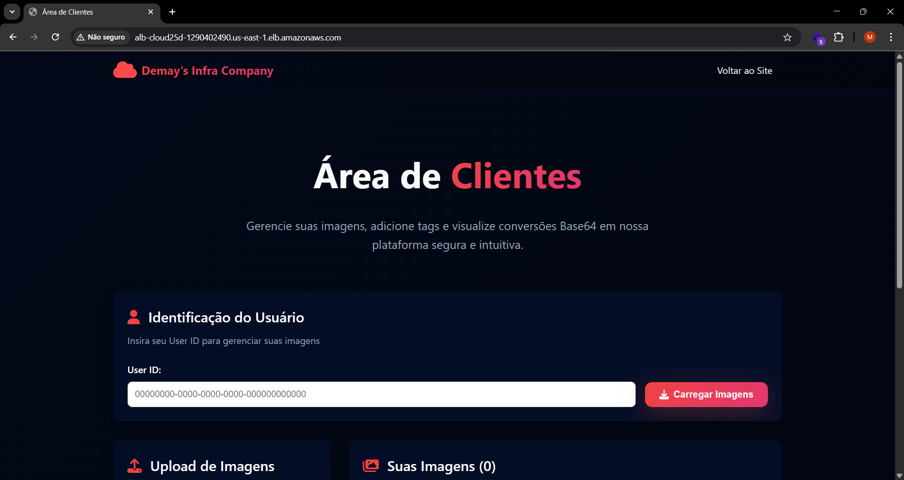
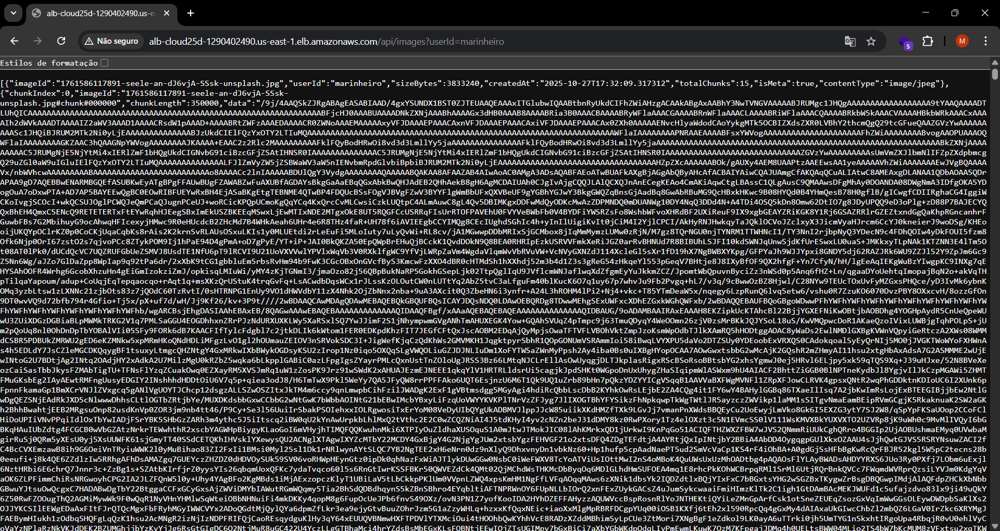
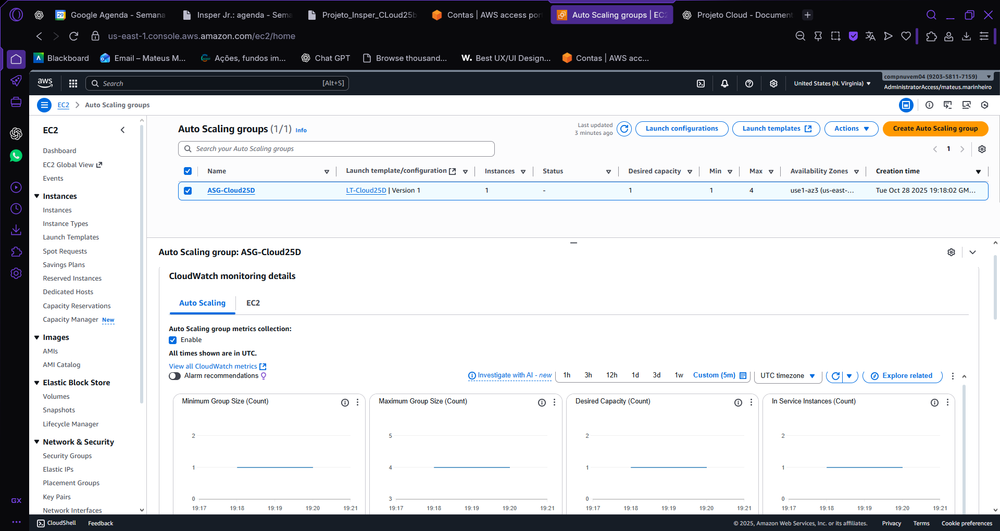
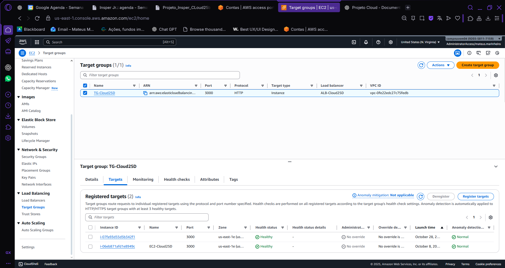
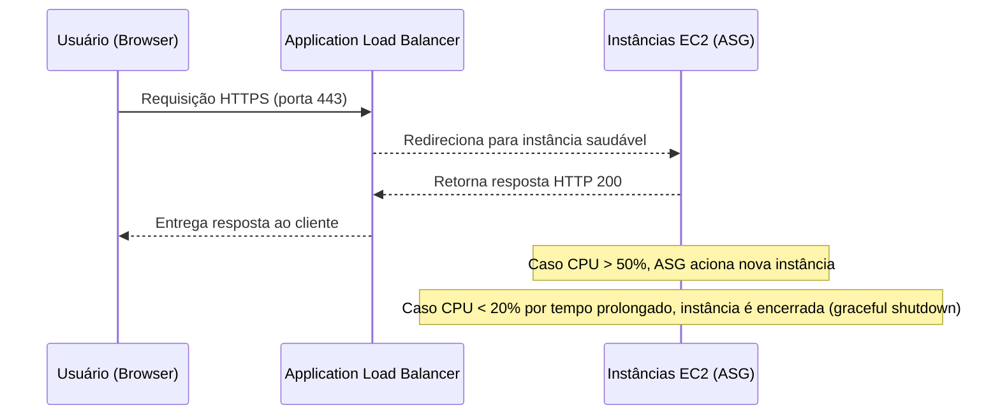

## Anexo A 
---
### Estágio 3 - Área de Clientes + Escalabilidade (Obj. 3)
---
#### Regular (2)

Nesta etapa o foco é validar o funcionamento completo da **Área de Clientes**, garantindo que ela esteja **acessível publicamente via ALB** e que consiga **consultar as imagens armazenadas no DynamoDB** através do backend hospedado na EC2.

---

##### Objetivo
- Tornar o front-end da área de clientes acessível pelo domínio do **Application Load Balancer (ALB)**.  
- Permitir que o usuário consulte as imagens do seu `userId`.  
- Implementar o endpoint `GET /api/images/:id` para retornar o conteúdo em Base64 de uma imagem específica.  

Essa etapa comprova que a aplicação é **funcional, acessível e escalável**, com comunicação entre front-end, ALB, backend e banco DynamoDB.

---

##### Configuração do ALB
- **DNS público:** `http://alb-cloud25d-1290402490.us-east-1.elb.amazonaws.com`  
- **Listener:** Porta 80 (HTTP) direcionando para o Target Group `cloud25b-target`.  
- **Health check:** `/health` (resposta HTTP 200 OK).

**Evidência — ALB Ativo**


*Figura 1 — ALB ativo na região us-east-1, com listener HTTP e target group saudável.*

---

##### Backend — Endpoints principais
O backend implementa endpoints REST, conforme especificado no `server.js`:

```js
// Retorna lista de imagens de um usuário
GET /api/images?userId=<id>

// Retorna o Base64 de uma imagem específica
GET /api/images/:id?userId=<id>
```

**Evidência — Resposta do endpoint**


*Figura 2 — Resposta JSON do endpoint /api/images/:id, contendo o Base64 da imagem e o contentType.*

---

##### Front-end — Área de Clientes
A interface da área de clientes agora permite:
- Inserir o `userId` e listar as imagens disponíveis.
- Selecionar uma imagem e visualizar seu conteúdo (convertido de Base64).

Trecho JS responsável por consumir a API:
```js
async function fetchImageById(userId, imageId) {
  const response = await fetch(`/api/images/${imageId}?userId=${userId}`);
  const data = await response.json();
  console.log('Imagem Base64:', data.base64);
  const img = document.getElementById('preview');
  img.src = `data:${data.contentType};base64,${data.base64}`;
}
```

**Evidência — Página da Área de Clientes carregando imagens**


*Figura 3 — Página da área de clientes listando imagens e exibindo preview via Base64.*

---

##### Segurança e Rede
- **Security Group da EC2:** permite tráfego HTTP (porta 80/3000) **apenas** do SG do ALB.  
- **Health check:** configurado no Target Group para `/health` (status 200).  
- **CORS habilitado** no backend para permitir chamadas do front-end hospedado via ALB.  

---

#### Bom (3)

Nesta etapa, o foco é garantir que a **área de clientes** esteja operando de forma **escalável e resiliente**, utilizando os recursos do **Application Load Balancer (ALB)** e do **Auto Scaling Group (ASG)** da AWS.

O objetivo é que a aplicação se mantenha disponível mesmo com variações de carga ou falhas em instâncias individuais, assegurando o balanceamento automático e o monitoramento da saúde das instâncias.

---

##### Componentes e Configurações

##### Application Load Balancer (ALB)
O **ALB** é responsável por distribuir as requisições HTTP/HTTPS entre as instâncias EC2 do ASG.

- **Listeners configurados:**
  - Porta **80 (HTTP)** redirecionando para **443 (HTTPS)**.
  - Porta **443 (HTTPS)** com certificado **ACM** válido configurado.
- **Target Group:** associado ao ASG, com health check configurado para rota `/health`.
- **Protocolos:** HTTP/2 habilitado; forward para targets em várias AZs.

**Evidência — Listener HTTPS com ACM**  

  
*Figura 1 — Configuração do listener 443 com certificado ACM ativo.*

---

##### Auto Scaling Group (ASG)
O **ASG** garante que o número de instâncias EC2 atenda à demanda, mantendo disponibilidade e desempenho adequados.

- **Configuração principal:**
  - Mínimo: **2 instâncias**
  - Máximo: **4 instâncias**

**Evidência — Gráfico de Desired x InService**  

  
*Figura 2 — Métricas do ASG mostrando instâncias desejadas e em serviço.*

---

##### Health Checks

Os health checks são configurados para verificar periodicamente a rota `/health` exposta pela aplicação Node.js no EC2.

- **Intervalo:** 30 segundos  
- **Threshold:** 2 consecutivos para sucesso/falha  
- **Resposta esperada:** HTTP 200

**Evidência — Target Health**  

  
*Figura 3 — Targets do ALB marcados como saudáveis (verde) em múltiplas zonas de disponibilidade.*

---

##### Fluxo Geral de Escalabilidade


